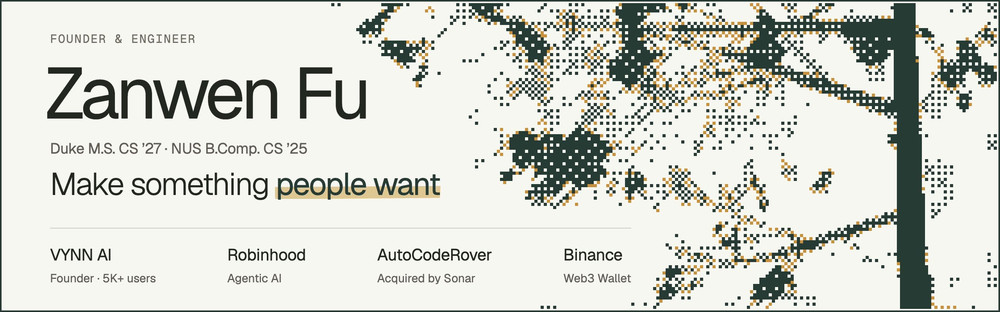

  <a href="https://zanwenfu.com"><b>zanwenfu.com</b></a> &nbsp;·&nbsp;
  <a href="https://www.linkedin.com/in/zanwenfu">LinkedIn</a> &nbsp;·&nbsp;
  <a href="https://x.com/zanwenfu">X</a> &nbsp;·&nbsp;
  <a href="mailto:zanwen.fu@duke.edu">zanwen.fu@duke.edu</a>

Agents are easy to demo and hard to depend on. I build the ones people depend on.

I founded VYNN AI and built every part of it myself. Before that I was an early employee at AutoCodeRover, one of the first coding agents, which Sonar acquired. I've shipped agentic AI at Robinhood and reliability infrastructure for Binance's Web3 Wallet. What I took from all of it: the model is rarely what decides whether an agent holds up. Everything around it is. That's what I build now.

### Building

**[VYNN AI](https://vynnai.com)**: a personal financial analyst for every investor 
Founder and sole engineer · 2025 to now · [how it's built](https://zanwenfu.com/projects/vynn-ai) · [agent code](https://github.com/Agentic-Analyst/stock-analyst)

Ask about any company, fund, coin or prediction market and get a sourced report and a live Excel model in about two minutes, for about three cents. More than 5,000 investors have signed up, and the first 500 came without a dollar of marketing. The model never writes a number. Code computes every figure, and when VYNN disagrees with Wall Street, it stands by its number and shows you both.

**[Agent OS](https://github.com/zanwenfu/taste-is-all-you-need)**: an operating system for AI agents 
Creator · 2026 · [how it works](https://zanwenfu.com/projects/agent-os) · [the thesis](https://zanwenfu.com/blog/agent_harness_blog)

Every team building agents rebuilds the same plumbing: memory, rollback, checks, budgets. Agent OS is the layer underneath them. A central brain plans the work, each piece runs in its own process, and a monitor that can't touch anything signs off. Every step is a commit in git, so nothing unverified ships and nothing is ever lost.

### Shipped

**Robinhood**: Agentic AI team 
Machine Learning Engineer Intern · 2026 · [Robinhood Cortex](https://robinhood.com/us/en/newsroom/robinhood-presents-yes-no-event/)

I solo-designed and shipped a proactive agent for Robinhood Cortex that decides when market news deserves a customer's attention, instead of waiting to be asked. It cut false positives five-fold in backtesting with no material event missed and scaled coverage 30× at flat latency. I also caught and fixed a production delivery failure that monitoring had missed.

**[AutoCodeRover](https://github.com/AutoCodeRoverSG/auto-code-rover)**: one of the first coding agents, acquired by Sonar 
Early employee · 2024 to 2025 · [IDE plugin](https://github.com/zanwenfu/jetbrains-ide-plugin) · [the story](https://zanwenfu.com/blog/acr_blog)

In 2024, before Claude Code or Codex, it fixed real GitHub issues on its own. I worked on lifting it to 51.6% on SWE-bench Verified and built Self-Fix, which traces a rejected patch back to the step that went wrong. I also built the JetBrains plugin end to end, which merges the agent's fix into the developer's latest code. After Sonar acquired it in 2025, the former AutoCodeRover team's Foundation Agent reached [#1 on SWE-bench's unfiltered leaderboard](https://www.sonarsource.com/company/press-releases/sonar-claims-top-spot-on-swe-bench-leaderboard/).

### Research

- **[LUMINA](https://github.com/zanwenfu/agentic-reviewers-for-SRMA)** · first author. Four agents that screen studies for medical systematic reviews: 98.2% sensitivity across 15 published reviews, with 35× fewer missed studies than a published baseline, at under a cent per citation.
- **[architectural-damping](https://github.com/zanwenfu/architectural-damping)** · Prompt injections fooled VYNN's language model every time. In a 12-case pilot, the calculator behind it stopped 10 of them from reaching what users see, and reading its source predicted which ones would get through.
- **[speculative-decoding-t4](https://github.com/zanwenfu/speculative-decoding-t4)** · Sequoia's cost model predicts a 1.68× speedup on a T4. I measured 0.56×, and one measured cost explains the gap to within 1.1%.
- **[football-llm](https://github.com/zanwenfu/football-llm)** · My fine-tuned Llama seemed to beat XGBoost at World Cup predictions. With team names hidden, its exact-score accuracy fell from 43.8% to 10.9%. It had memorized the 2022 tournament.

### Writing

- **[Beyond the Harness: An Operating System for AI Agents](https://zanwenfu.com/blog/agent_harness_blog)**: git as an agent's memory, and why everyone stops at the OS metaphor.
- **[From Research Agent to Acquired Product](https://zanwenfu.com/blog/acr_blog)**: putting a research agent inside the IDE without breaking the developer's flow.
- **[Building VYNN AI as Its Sole Engineer](https://zanwenfu.com/blog/vynnai_blog)**: keeping language models away from the numbers.

---

  Off the keyboard: <a href="https://zanwenfu.com/music">fifteen years of clarinet</a>. 
  Making something people want? I'd like to hear about it: <a href="mailto:zanwen.fu@duke.edu">zanwen.fu@duke.edu</a>

